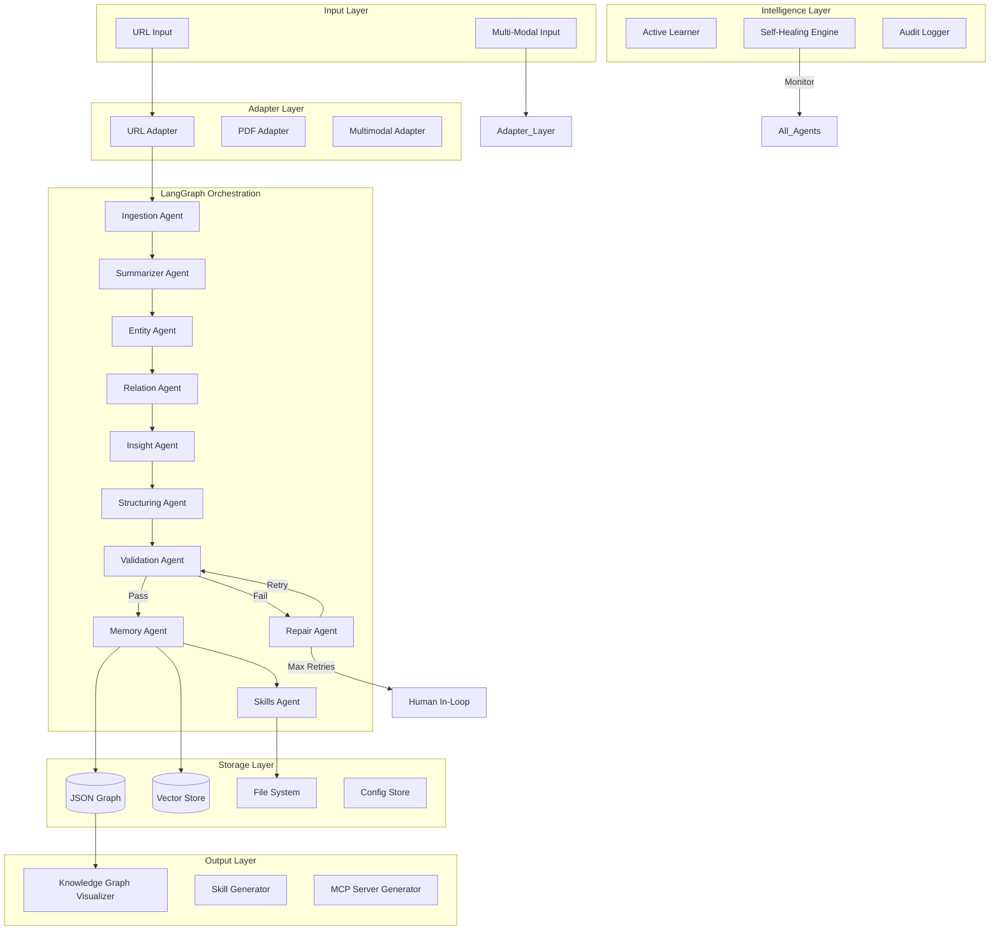
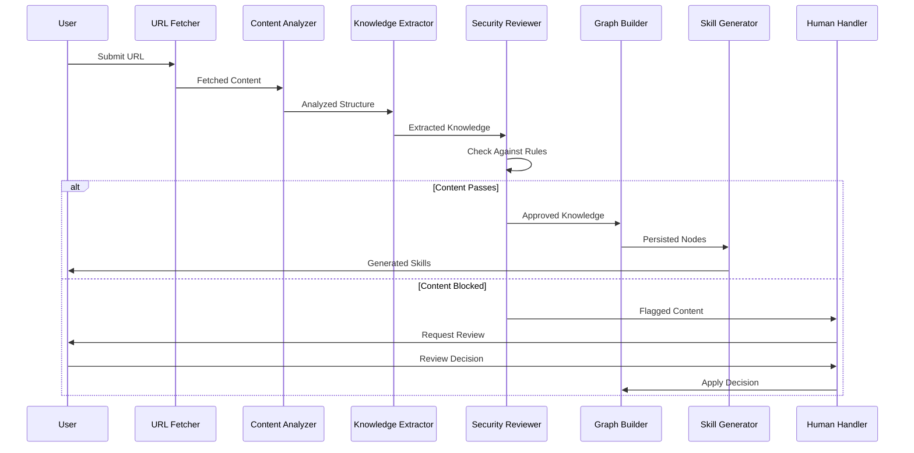
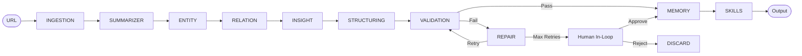
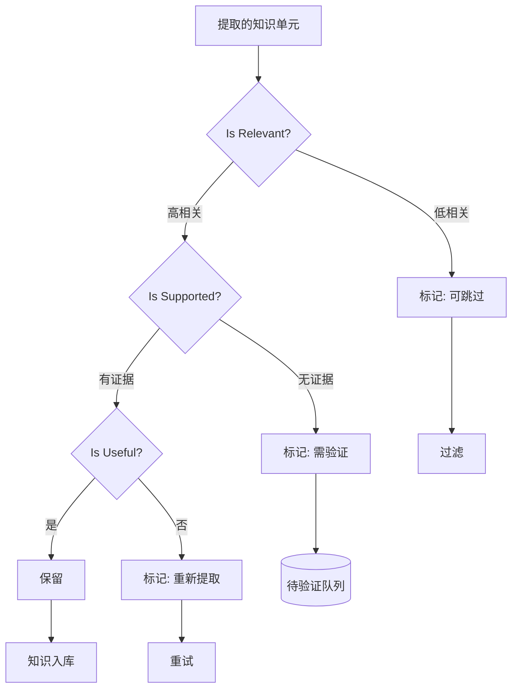
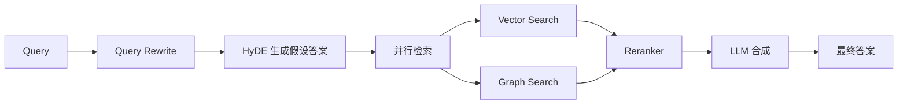
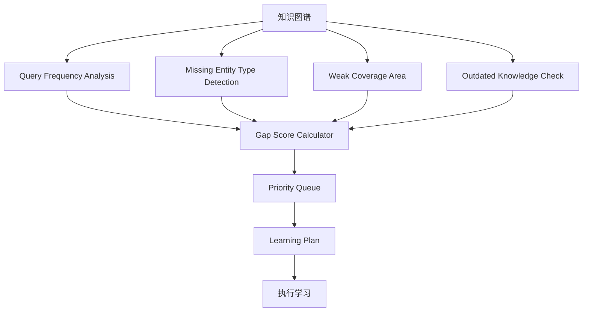
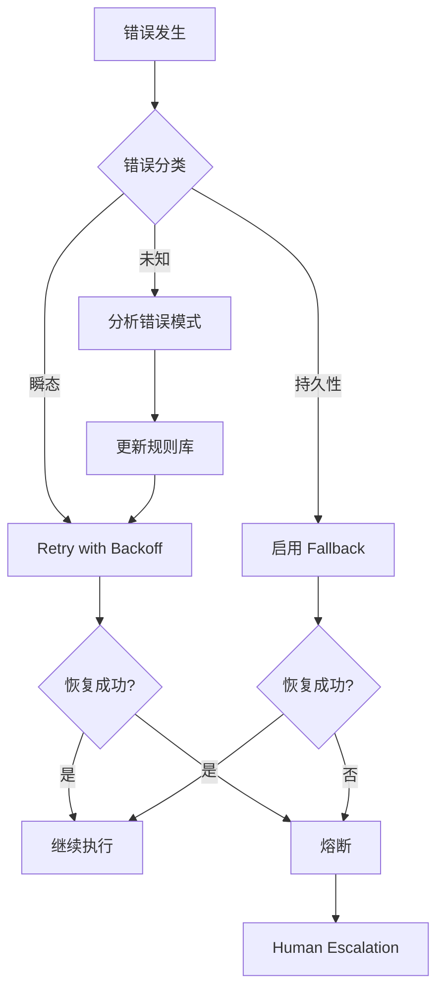
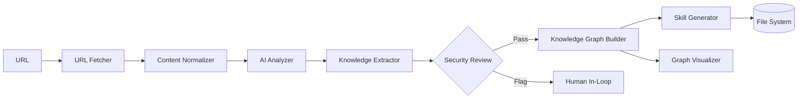
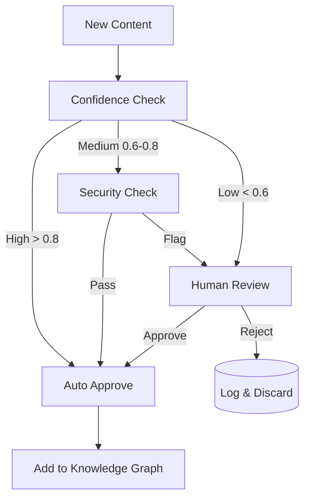
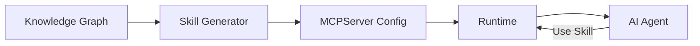

# AI 知识图谱自生长系统 - 技术设计规格

Feature Name: ai-knowledge-graph-auto-growth
Created: 2026-03-23
Version: 0.3.0 (Enhanced with LangGraph + GPT Best Practices)

---

## 1. 系统架构

### 1.0 版本历史

| 版本 | 日期 | 更新内容 |
|------|------|----------|
| 0.1.0 | 2026-03-23 | 初始版本 |
| 0.3.0 | 2026-03-23 | 整合 LangGraph 编排 + JSON graph 轻量存储 + GPT 方案优点 |

### 1.1 整体架构图（LangGraph 编排 + 轻量存储）



**核心优势：**
- LangGraph 提供 DAG + 状态机，流程可视化，调试方便
- JSON Graph 轻量原型，Neo4j 预留扩展
- 每个 Agent 独立，可单独测试和替换

### 1.2 核心处理流程



---

## 2. 组件设计

### 2.1 配置中心 (Configuration Manager)

**职责：** 统一管理系统全部配置（单一 YAML 文件）

**配置结构 (config.yaml) - 简化版：**
```yaml
# 核心模型配置
model:
  summarizer: "gpt-4o-mini"
  extractor: "gpt-4o"
  embedding: "text-embedding-3-small"

# Pipeline 配置
pipeline:
  max_tokens: 8000
  retry_limit: 3
  fallback_parsers:
    - "jina-reader"
    - "readability-lxml"

# 置信度阈值
confidence:
  threshold: 0.7
  low_confidence_action: "human_review"  # human_review | auto_approve | discard

# 存储配置
storage:
  markdown_path: "./data/md"
  graph_path: "./data/graph"
  skills_path: "./data/skills"
  vector_store: "chroma"  # chroma | qdrant
  vector_persist: "./data/vectors"
  # 预留 Neo4j（原型阶段使用 JSON Graph）
  # neo4j_uri: "bolt://localhost:7687"

# 安全审查
security:
  enabled: true
  blacklist:
    harmful: ["violence", "crime", "illegal"]
    privacy: ["pii", "personal_data"]
    misleading: ["disinformation", "conspiracy"]
  action_on_match: "flag"  # flag | block

# 人类介入
human_inloop:
  enabled: true
  pending_review_dir: "./pending_review"
  auto_continue_on_timeout: false
  timeout_hours: 72

# 主动学习（预留）
active_learning:
  enabled: false
  trigger: "scheduled"  # scheduled | token_budget | goal_based
  cron: "0 2 * * *"
  token_daily_limit: 100000
  require_approval: true
  termination_file: ".stop_learning"

# 自愈配置
self_healing:
  enabled: true
  max_retries: 3
  # 外部验证（CRAG 预留）
  external_verification:
    enabled: false
    trigger_threshold: 0.6
    provider: "duckduckgo"
```

**设计说明：**
- 单一 YAML 文件，减少配置复杂度
- 向后兼容：Neo4j/Qdrant 预留配置项，原型阶段使用轻量方案
- 人类介入最小化：仅在低置信度时触发

---

### 2.2 URL 抓取器 (URL Fetcher)

**职责：** 获取 URL 内容，提取主文本

**接口：**
```python
class URLFetcher:
    async def fetch(self, url: str) -> FetchResult
    def extract_main_content(self, html: str) -> ExtractedContent
    def detect_language(self, text: str) -> str
```

**输出结构：**
```python
@dataclass
class FetchResult:
    url: str
    status_code: int
    headers: Dict[str, str]
    content: bytes
    encoding: str
    final_url: str  # 重定向后URL

@dataclass
class ExtractedContent:
    title: str
    text: str
    images: List[str]
    links: List[str]
    language: str
    publish_date: Optional[str]
```

---

## 2.2 LangGraph DAG 定义（核心编排）

**DAG 流程：**


**LangGraph 代码框架：**
```python
# app/orchestrator/graph.py
from langgraph.graph import StateGraph, END

def create_pipeline() -> StateGraph:
    workflow = StateGraph(PipelineState)
    
    # 添加节点
    workflow.add_node("ingestion", ingestion_agent.run)
    workflow.add_node("summarizer", summarizer_agent.run)
    workflow.add_node("entity", entity_agent.run)
    workflow.add_node("relation", relation_agent.run)
    workflow.add_node("insight", insight_agent.run)
    workflow.add_node("structuring", structuring_agent.run)
    workflow.add_node("validation", validation_agent.run)
    workflow.add_node("repair", repair_agent.run)
    workflow.add_node("memory", memory_agent.run)
    workflow.add_node("skills", skills_agent.run)
    
    # 定义边
    workflow.add_edge("ingestion", "summarizer")
    workflow.add_edge("summarizer", "entity")
    workflow.add_edge("entity", "relation")
    workflow.add_edge("relation", "insight")
    workflow.add_edge("insight", "structuring")
    workflow.add_edge("structuring", "validation")
    workflow.add_edge("validation", "memory", condition=lambda s: s["validated"])
    workflow.add_edge("validation", "repair", condition=lambda s: not s["validated"])
    workflow.add_edge("repair", "validation")  # 重试
    workflow.add_edge("memory", "skills")
    workflow.add_edge("skills", END)
    
    # 条件边：超过重试次数则人类介入
    def should_human介入(state):
        return state["retry_count"] >= config["pipeline"]["retry_limit"]
    
    workflow.add_conditional_edges(
        "repair",
        should_human介入,
        {"human": "human_inloop", "retry": "validation"}
    )
    
    return workflow.compile()

# 入口
app = create_pipeline()
result = app.invoke({"url": "https://example.com"})
```

**每个 Agent 的统一接口：**
```python
class BaseAgent(ABC):
    @abstractmethod
    def run(self, state: PipelineState) -> PipelineState:
        """每个 Agent 必须实现的接口"""
        pass
    
    def call_llm(self, prompt: str, schema: Type[BaseModel]) -> BaseModel:
        """统一 LLM 调用"""
        response = openai.chat.completions.create(
            model=self.config["model"]["extractor"],
            messages=[{"role": "user", "content": prompt}],
            response_format={"type": "json_object", "schema": schema.model_json_schema()}
        )
        return schema.model_validate_json(response.choices[0].message.content)
```

---

### 2.3 AI 分析器 (AI Analyzer) - 增强版 (含 Self-Reflection)

**职责：** 调用 LLM 分析内容，提取知识，并进行自我反思验证

**接口：**
```python
class AIAnalyzer:
    def __init__(self, config: AIAnalysisConfig)
    async def analyze(self, content: ExtractedContent) -> AnalysisResult
    async def extract_knowledge(self, content: str, context: Dict) -> List[KnowledgeUnit]
    async def self_reflect(self, knowledge_units: List[KnowledgeUnit]) -> ReflectionResult
```

**Self-Reflection 流程：**


**反射检查 Prompt：**
```
你是一个知识质量审计员。请审查以下提取的知识是否满足质量标准：

知识单元：
{knowledge_unit}

请回答以下问题并给出 JSON：
{
  "is_relevant": true/false,  // 内容是否与原文主题相关
  "relevance_score": 0.0-1.0,
  "is_supported": true/false,  // 是否有足够的文本证据支持
  "supporting_evidence": ["证据片段"],
  "is_useful": true/false,    // 是否是有价值的知识
  "quality_score": 0.0-1.0,
  "issues": ["问题描述"],
  "suggestion": "改进建议"
}
```

**Prompt 模板：**
```
你是一个知识提取专家。从以下内容中提取结构化的知识节点和关系。

内容：
{content}

请以 JSON 格式输出：
{
  "topics": ["核心主题列表"],
  "entities": [
    {
      "name": "实体名称",
      "type": "person|organization|location|technology|concept",
      "description": "实体描述",
      "confidence": 0.0-1.0
    }
  ],
  "knowledge": [
    {
      "id": "唯一ID",
      "type": "claim|fact|relationship",
      "content": "知识内容",
      "confidence": 0.0-1.0,
      "supporting_evidence": ["支持证据"]
    }
  ],
  "relationships": [
    {
      "source": "来源节点ID",
      "target": "目标节点ID",
      "type": "implies|causes|similar_to|contrasts|part_of",
      "confidence": 0.0-1.0
    }
  ]
}
```

---

### 2.4 知识图谱构建器 (Knowledge Graph Builder)

**职责：** 存储和管理知识图谱

**新增：Entity Linker（实体链接器）**
```python
class EntityLinker:
    """解决同一实体不同表述问题 (Entity Disambiguation)"""
    def __init__(self, config: EntityLinkerConfig)
    async def link_entity(self, mention: str, context: str) -> List[CandidateEntity]
    async def disambiguate(self, candidates: List[CandidateEntity]) -> CanonicalEntity
    async def create_alias(self, canonical_id: str, alias: str) -> None
    def get_canonical_name(self, entity_id: str) -> str
```

**Entity Linking 流程：**
```
实体提及 → 候选生成 → 上下文编码 → 消歧选择 → 规范实体
   ↓
"AI" / "人工智能" / "Artificial Intelligence" → 统一为 "Artificial Intelligence (AI)"
```

**接口：**
```python
class KnowledgeGraphBuilder:
    def __init__(self, config: KnowledgeGraphConfig)
    async def add_node(self, node: KnowledgeNode) -> str
    async def add_edge(self, edge: KnowledgeEdge) -> str
    async def merge_nodes(self, node_ids: List[str], strategy: str) -> KnowledgeNode
    async def link_entity(self, mention: str, context: str) -> CanonicalEntity  # 新增
    async def query(self, query: str) -> QueryResult
    async def query_hybrid(self, query: str, vector_store: VectorStore) -> HybridResult  # 新增
    async def get_subgraph(self, node_id: str, depth: int) -> SubGraph
    async def export(self, format: str) -> bytes
```

**数据模型（整合版 - LangGraph State + Pydantic）：**

**LangGraph PipelineState：**
```python
# app/orchestrator/state.py
class PipelineState(TypedDict):
    url: str
    raw_text: str
    summary: str
    sections: List[str]
    entities: List[Entity]
    relations: List[Relation]
    insights: List[Insight]
    knowledge: Optional[Knowledge]
    validated: bool
    retry_count: int
    error: Optional[str]
```

**核心 Knowledge Schema（Pydantic）：**
```python
# app/schemas/knowledge.py
from pydantic import BaseModel, Field
from typing import List, Optional
from datetime import datetime

class Entity(BaseModel):
    name: str
    type: str  # Concept / Person / Tool / Method / Organization
    description: Optional[str] = None
    aliases: List[str] = []  # Entity Linking 用

class Relation(BaseModel):
    source: str  # 源实体名
    target: str  # 目标实体名
    type: str  # uses / enhances / depends_on / contrasts / implies
    confidence: float = Field(ge=0.0, le=1.0)
    evidence: Optional[List[str]] = None

class Insight(BaseModel):
    text: str  # 非显性信息
    insight_type: str  # implication / prediction / comparison / pattern
    confidence: float = Field(ge=0.0, le=1.0)
    supporting_entities: List[str] = []

class Knowledge(BaseModel):
    id: str  # UUID + 内容指纹
    title: str
    summary: str  # 核心摘要
    sections: List[str]  # 分段总结
    entities: List[Entity]
    relations: List[Relation]
    insights: List[Insight]
    tags: List[str]
    source: str  # URL
    created_at: datetime
    confidence: float = Field(ge=0.0, le=1.0)
    
    # Entity Linking
    canonical_entities: Dict[str, str] = {}  # alias -> canonical_id
    
    # 预留字段
    metadata: Dict = {}
```

**Skill Schema：**
```python
# app/schemas/skill.py
class Skill(BaseModel):
    name: str  # kebab-case: explain-xxx
    version: str  # semver
    description: str
    category: str  # knowledge / tool / method
    tags: List[str]
    parameters: dict  # JSON Schema
    actions: List[dict]  # 操作步骤
    examples: List[dict]  # 使用示例
    context_refs: List[str]  # 关联的 Knowledge IDs
    confidence: float
    generated_at: datetime
```

**数据模型：**
```python
@dataclass
class KnowledgeNode:
    id: str  # UUID + 内容指纹
    type: NodeType  # concept, entity, event, claim, relation
    name: str
    description: str
    source_url: str
    created_at: datetime
    updated_at: datetime
    confidence: float
    tags: List[str]
    metadata: Dict[str, Any]

@dataclass
class KnowledgeEdge:
    id: str
    source_id: str
    target_id: str
    relation_type: EdgeType
    confidence: float
    evidence: List[str]
    created_at: datetime
    metadata: Dict[str, Any]

@dataclass
class KnowledgeEntry:
    node: KnowledgeNode
    summary: str  # 供人类审核的摘要
    status: EntryStatus  # pending, approved, rejected
    reviewed_by: Optional[str]
    reviewed_at: Optional[datetime]
```

---

### 2.4.5 Hybrid Query Engine（混合检索引擎）

**职责：** 融合向量检索和图检索，提供更准确的查询结果

**架构：**


**接口：**
```python
class HybridQueryEngine:
    def __init__(self, graph_db: GraphDatabase, vector_store: VectorStore)
    async def query(self, user_query: str, options: QueryOptions) -> HybridResult
    async def rewrite_query(self, query: str) -> List[str]  # 子查询分解
    async def rerank(self, vector_results: List, graph_results: List) -> List[RerankedResult]
```

**配置新增：**
```yaml
hybrid_retrieval:
  enabled: true
  vector_weight: 0.4  # 向量检索权重
  graph_weight: 0.6    # 图检索权重
  use_hyde: true       # 使用 HyDE 生成假设答案
  reranker_model: "cross-encoder/ms-marco-MiniLM-L-6-v2"
  top_k: 20            # 召回数量
```

---

### 2.5 Skill 生成器 (Skill Generator)

**职责：** 将知识条目转换为可执行的 Skills/MCP 格式

**接口：**
```python
class SkillGenerator:
    def __init__(self, config: SkillGeneratorConfig)
    def generate(self, knowledge_entry: KnowledgeEntry) -> Skill
    def generate_batch(self, entries: List[KnowledgeEntry]) -> List[Skill]
    def export_to_file(self, skill: Skill, path: str) -> None
    def generate_mcp_server(self, skills: List[Skill]) -> MCPServerDefinition
```

**Skill 输出格式：**
```json
{
  "name": "understand-[topic-name]",
  "version": "1.0.0",
  "description": "This skill provides knowledge about [topic]",
  "category": "knowledge",
  "tags": ["topic", "domain"],
  "parameters": {
    "type": "object",
    "properties": {
      "query": {
        "type": "string",
        "description": "The specific question about [topic]"
      }
    },
    "required": ["query"]
  },
  "actions": [
    {
      "step": 1,
      "description": "Recall relevant knowledge about [topic]",
      "instruction": "Search the knowledge graph for nodes related to [topic]"
    },
    {
      "step": 2,
      "description": "Synthesize information",
      "instruction": "Combine relevant nodes to form a comprehensive answer"
    }
  ],
  "examples": [
    {
      "input": "What is [topic]?",
      "output": "Detailed explanation based on knowledge graph"
    }
  ],
  "source_knowledge_ids": ["node_id_1", "node_id_2"],
  "confidence": 0.85,
  "generated_at": "2026-03-23T12:00:00Z"
}
```

---

### 2.6 安全审查器 (Security Reviewer)

**职责：** 检测有害内容，保护系统安全

**接口：**
```python
class SecurityReviewer:
    def __init__(self, config: SecurityReviewConfig)
    async def review(self, content: str) -> SecurityResult
    async def check_keywords(self, text: str) -> List[KeywordMatch]
    async def secondary_review(self, content: str) -> SecondaryResult  # AI 二次审查
```

**输出结构：**
```python
@dataclass
class SecurityResult:
    status: SecurityStatus  # passed, flagged, blocked
    matches: List[KeywordMatch]
    confidence: float
    reason: str
    action_taken: str
    reviewed_at: datetime

@dataclass
class KeywordMatch:
    category: str  # harmful, privacy, misleading
    keyword: str
    position: int  # 匹配位置
    context: str   # 上下文
```

---

### 2.7 主动学习器 (Active Learner) - 增强版 (含 Knowledge Gap Detection)

**职责：** 依据目标自动搜索和学习知识，并主动发现知识缺口

**接口：**
```python
class ActiveLearner:
    def __init__(self, config: ActiveLearningConfig)
    async def learn(self, goal: LearningGoal) -> LearningResult
    async def search_knowledge(self, query: str) -> List[SearchResult]
    async def evaluate_knowledge_gap(self) -> Dict[str, float]
    async def detect_gaps(self) -> List[KnowledgeGap]
    async def plan_learning(self, gaps: List[KnowledgeGap]) -> LearningPlan
    def should_terminate(self) -> bool  # 检查终止信号
```

**Knowledge Gap Detection 流程：**


**Knowledge Gap 数据模型：**
```python
@dataclass
class KnowledgeGap:
    gap_type: GapType  # missing_entity, weak_relation, outdated, low_coverage
    target: str  # 缺口目标描述
    impact_score: float  # 影响程度
    uncertainty: float  # 不确定性
    suggested_queries: List[str]  # 建议搜索词
    priority: float  # computed: impact × uncertainty / cost
```

---

### 2.8 自愈引擎 (Self-Healing Engine) - 增强版 (含 CRAG 外部验证)

**职责：** 自动处理可预测错误，并支持知识验证

**错误分类引擎：**
```python
class ErrorClassifier:
    """将错误分类为：瞬态 / 持久性 / 未知"""
    def classify(self, error: Exception) -> ErrorCategory
    def should_retry(self, error: Exception) -> bool
    def should_escalate(self, error: Exception) -> bool
```

**增强的恢复策略：**
```python
class SelfHealingStrategy(ABC):
    @abstractmethod
    def can_handle(self, error: Exception) -> bool
    @abstractmethod
    async def heal(self, error: Exception) -> HealingResult

class RetryStrategy(SelfHealingStrategy):
    """指数退避重试"""
    async def heal(self, error: Exception) -> HealingResult

class FallbackStrategy(SelfHealingStrategy):
    """降级到备用方案（备用模型/备用数据源）"""

class CircuitBreakerStrategy(SelfHealingStrategy):
    """熔断器模式（快速失败，防止雪崩）"""

class ExternalVerificationStrategy(SelfHealingStrategy):
    """CRAG 外部验证：当知识置信度低时，自动触发网页搜索验证"""

class HumanEscalationStrategy(SelfHealingStrategy):
    """人工升级：不可恢复错误升级给人工处理"""
```

**Self-Healing 流程：**


**配置增强：**
```yaml
self_healing:
  enabled: true
  max_retries: 3
  backoff_multiplier: 2.0
  error_log: "logs/error_recovery.jsonl"
  
  # 新增：外部验证配置
  external_verification:
    enabled: true
    trigger_confidence_threshold: 0.6
    web_search_provider: "duckduckgo"  # or "serpapi"
    max_verification_results: 5
    
  # 新增：熔断器配置
  circuit_breaker:
    failure_threshold: 5
    recovery_timeout: 60
```

---

## 3. 目录结构（LangGraph + Agent 模式）

```
knowledge-os/
├── app/
│   ├── main.py                    # 入口文件
│   ├── config.yaml                # 唯一配置文件
│   ├── orchestrator/
│   │   ├── graph.py              # LangGraph DAG 定义
│   │   └── state.py              # PipelineState 状态定义
│   ├── agents/
│   │   ├── ingestion.py           # Ingestion Agent (URL → raw text)
│   │   ├── summarizer.py          # Summarizer Agent (分段总结)
│   │   ├── entity.py              # Entity Agent (实体抽取)
│   │   ├── relation.py            # Relation Agent (关系抽取)
│   │   ├── insight.py             # Insight Agent (洞察提取 - 核心价值)
│   │   ├── structuring.py        # Structuring Agent (组装 Knowledge)
│   │   ├── validation.py         # Validation Agent (质量检查)
│   │   ├── repair.py             # Repair Agent (LLM 自修复)
│   │   ├── memory.py             # Memory Agent (存储写入)
│   │   └── skills.py            # Skills Agent (生成 Skills)
│   ├── schemas/
│   │   ├── knowledge.py           # Knowledge Schema (核心数据结构)
│   │   └── skill.py              # Skill Schema
│   ├── storage/
│   │   ├── markdown.py            # Markdown 文件存储
│   │   ├── vector.py             # Vector Store (Chroma)
│   │   └── graph.py              # JSON Graph 存储
│   ├── utils/
│   │   ├── llm.py                # LLM 统一接口
│   │   ├── retry.py              # 重试机制
│   │   └── confidence.py         # 置信度计算
│   └── prompts/
│       ├── summarizer.txt         # Summarizer Prompt
│       ├── entity.txt             # Entity Prompt
│       ├── relation.txt           # Relation Prompt
│       ├── insight.txt            # Insight Prompt
│       └── repair.txt             # Repair Prompt
├── data/
│   ├── md/                       # Markdown 输出
│   ├── graph/                    # JSON Graph 输出
│   ├── skills/                   # Skills JSON 输出
│   └── vectors/                  # Chroma 向量存储
├── pending_review/               # 待人工审核
├── logs/
│   ├── error_recovery.jsonl
│   └── security_review.jsonl
├── tests/
│   ├── unit/
│   ├── integration/
│   └── fixtures/
├── pyproject.toml
├── requirements.txt
└── README.md
```

**设计说明：**
- **LangGraph DAG**：每个 Agent 是节点，state 是边上的数据
- **独立 prompts**：便于调试和迭代
- **JSON Graph 优先**：原型阶段减少 Neo4j 依赖
- **Chroma 轻量**：原型阶段向量存储首选

---

## 4. 核心数据流

### 4.1 内容处理流程



### 4.2 知识入库决策流程



---

## 5. 错误处理策略

| 错误类型 | 处理策略 | 恢复方式 |
|----------|----------|----------|
| URL 抓取超时 | 重试 | 更换 User-Agent，降低并发 |
| LLM API 限流 | 队列 + 退避 | 指数退避，启用备用模型 |
| 图数据库断开 | 缓存 | 本地缓存，定期重连 |
| 解析格式错误 | 记录 + 标记 | 标记人工审核 |
| 安全审查不确定 | 升级 | 人工判断 |

---

## 6. MCP Server 集成（长远）



**MCP Server 配置文件：**
```json
{
  "mcp_version": "1.0.0",
  "name": "knowledge-graph-mcp",
  "description": "Access knowledge graph for AI agents",
  "tools": [
    {
      "name": "search_knowledge",
      "description": "Search knowledge graph by topic or entity",
      "inputSchema": {
        "type": "object",
        "properties": {
          "query": {"type": "string"},
          "limit": {"type": "integer", "default": 10}
        }
      }
    },
    {
      "name": "get_related",
      "description": "Get related knowledge nodes",
      "inputSchema": {
        "type": "object",
        "properties": {
          "node_id": {"type": "string"},
          "depth": {"type": "integer", "default": 1}
        }
      }
    }
  ]
}
```

---

## 7. 扩展性设计

### 7.1 插件式 Adapter

```python
class BaseAdapter(ABC):
    @abstractmethod
    def can_handle(self, input_type: str) -> bool
    @abstractmethod
    async def adapt(self, input_data: Any) -> ContentUnit

class AdapterRegistry:
    def register(self, adapter: BaseAdapter) -> None
    def get(self, input_type: str) -> BaseAdapter
    def list_all(self) -> List[BaseAdapter]
```

### 7.2 插件式 Output

```python
class BaseOutputAdapter(ABC):
    @abstractmethod
    def can_handle(self, output_type: str) -> bool
    @abstractmethod
    async def export(self, data: KnowledgeGraph, options: Dict) -> bytes

class OutputAdapterRegistry:
    def register(self, adapter: BaseOutputAdapter) -> None
    def get(self, output_type: str) -> BaseOutputAdapter
```

---

## 8. 安全考虑

1. **输入验证**：所有外部输入严格验证，防止注入攻击
2. **API 密钥**：存储在环境变量，不写入配置文件
3. **数据隔离**：不同租户数据逻辑隔离
4. **审计日志**：所有操作记录日志，可追溯
5. **内容过滤**：黑名单 + AI 二次审查
6. **速率限制**：API 调用限流，防止滥用

---

## 9. 性能优化

1. **并发处理**：使用 async/await 提高吞吐量
2. **缓存**：热门知识节点缓存到内存
3. **批处理**：小任务批量提交，减少 API 调用
4. **懒加载**：图可视化懒加载大图谱
5. **索引**：向量数据库索引优化检索

---

## 10. 测试策略

| 测试类型 | 覆盖内容 | 工具 |
|----------|----------|------|
| 单元测试 | 各模块独立逻辑 | pytest |
| 集成测试 | 模块间交互 | pytest + docker |
| E2E 测试 | 完整流程 | Playwright |
| 压力测试 | 高并发场景 | locust |
| 安全测试 | 注入攻击、绕过 | OWASP ZAP |

---

## 11. 部署建议

### 原型阶段
- 单机部署，Neo4j Community Edition
- Docker Compose 一键启动

### 生产阶段
- Kubernetes 集群部署
- Neo4j Enterprise + 因果集群
- Redis 缓存层
- CDN 加速静态资源

---

## 12. 依赖技术栈

| 层级 | 技术 | 说明 |
|------|------|------|
| 语言 | Python 3.11+ | 生态丰富 |
| 框架 | FastAPI | 异步，高性能 |
| 图数据库 | Neo4j | 成熟，稳定 |
| 向量检索 | Qdrant | 轻量，易用 |
| LLM 集成 | LiteLLM | 统一接口 |
| URL 抓取 | Playwright | JS 渲染支持 |
| 配置 | Pydantic + YAML | 类型安全 |
| 可视化 | D3.js | 成熟，交互强 |

