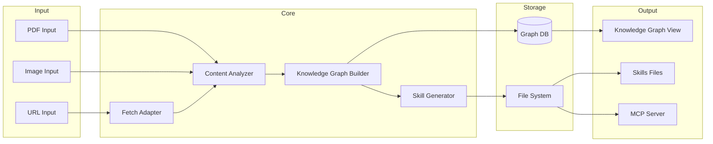

# AI 知识图谱自生长系统 (AI Knowledge Graph Auto-Growth System)

## 1. 引言

### 1.1 功能概述

一个 AI 驱动的知识管理系统，能够自动从 URL 等输入源提取信息，通过 AI 分析提炼知识节点和关系，构建可演进的知识图谱，并输出人类可读的知识图谱和 AI 工具可用的 Skills/MCP 格式。

### 1.2 设计目标

| 目标 | 描述 |
|------|------|
| 自动化 | 输入 URL 等内容，自动完成知识抽取、分类、图谱构建全流程 |
| 可演进 | 原型阶段支持 URL 输入 + 静态 Skills 输出，长远支持多模态 + MCP 原生集成 |
| 最小化介入 | 配置文件集中管理，问题自修复，仅不确定时询问人类 |
| 可信安全 | 有害内容过滤，价值观审查（可选），知识溯源 |
| 主动学习 | 定时/定目标自动搜索学习，人类审核入库（长远目标） |

---

## 2. 词汇表

| 术语 | 定义 |
|------|------|
| **知识节点 (Knowledge Node)** | 图谱中的基本单元，表示一个实体、概念或事实 |
| **知识边 (Knowledge Edge)** | 节点之间的关系，标注关系类型和可信度 |
| **知识图谱 (Knowledge Graph)** | 节点和边构成的有向图结构 |
| **Skill** | AI 工具可执行的技能定义，包含描述、参数和执行逻辑 |
| **MCP Server** | Model Context Protocol 服务器，提供 Skills 的运行时环境 |
| **知识条目 (Knowledge Entry)** | 经过 AI 分析后提取的最小知识单元 |
| **摘要记录 (Summary Record)** | 每条生成知识的简短描述，供人类审核 |
| **安全审查 (Security Review)** | 对输入/输出内容进行有害内容检测的机制 |
| **配置中心 (Config Center)** | 集中管理系统配置的组件 |

---

## 3. 需求

### 3.1 系统配置管理

**用户故事：** 作为系统管理员，我需要集中管理系统配置，以便维护和调整系统行为。

#### Acceptance Criteria

1. WHEN 系统启动，Configuration Manager SHALL 从 `config/config.yaml` 加载全部配置。
2. WHEN 配置项被修改并触发重载，Configuration Manager SHALL 动态应用到对应模块，无需重启进程。
3. IF 配置文件格式错误，Configuration Manager SHALL 记录错误到日志并使用默认配置继续运行。
4. IF 配置项缺失，Configuration Manager SHALL 使用预设默认值填充并记录警告。

---

### 3.2 URL 内容抓取与解析

**用户故事：** 作为系统，我需要从 URL 提取原始内容，以便后续 AI 分析处理。

#### Acceptance Criteria

1. WHEN 用户提交 URL 请求，URL Fetcher SHALL 使用 HTTP GET 获取页面内容（支持 302 重定向）。
2. WHEN 页面加载完成，URL Fetcher SHALL 自动检测并提取主内容（标题、正文、图片 URL）。
3. IF URL 返回非 200 状态码，URL Fetcher SHALL 记录错误状态并标记任务失败。
4. IF 页面内容编码不是 UTF-8，URL Fetcher SHALL 自动转码。
5. IF 内容超过预设阈值（默认 1MB），URL Fetcher SHALL 截断并记录警告。
6. URL Fetcher SHALL 支持 JavaScript 渲染页面的可选抓取（通过配置启用外部服务）。

---

### 3.3 AI 内容分析与知识提取

**用户故事：** 作为系统，我需要 AI 分析抓取的内容，提取知识节点和关系，以便构建知识图谱。

#### Acceptance Criteria

1. WHEN 原始内容准备就绪，AI Analyzer SHALL 调用配置的 LLM API 进行分析。
2. AI Analyzer SHALL 提取以下信息并结构化输出：
   - 核心主题（1-3 个）
   - 关键概念和定义
   - 实体列表（人物、地点、机构、技术等）
   - 事件和时序关系
   - 因果关系
   - 相似/对比关系
3. AI Analyzer SHALL 为每个知识节点生成唯一 ID（基于内容指纹 + 时间戳）。
4. AI Analyzer SHALL 为每条知识生成置信度分数（0.0-1.0）。
5. IF LLM API 调用超时（默认 30 秒），AI Analyzer SHALL 重试最多 3 次后标记失败。
6. IF LLM API 返回格式错误，AI Analyzer SHALL 记录原始响应并标记需要人工审核。

---

### 3.4 知识图谱构建与存储

**用户故事：** 作为系统，我需要将 AI 提取的知识存储到图数据库，以便查询和可视化。

#### Acceptance Criteria

1. WHEN AI Analyzer 输出分析结果，Knowledge Graph Builder SHALL 将节点和边写入图数据库。
2. Knowledge Graph SHALL 支持以下节点类型：`concept`、`entity`、`event`、`claim`、`relation`。
3. Knowledge Graph SHALL 支持以下边类型：`implies`、`causes`、`similar_to`、`contrasts`、`part_of`、`happens_before`。
4. 每个节点 SHALL 包含字段：`id`、`type`、`name`、`description`、`source_url`、`created_at`、`confidence`、`tags`。
5. 每条边 SHALL 包含字段：`source_id`、`target_id`、`relation_type`、`confidence`、`evidence`。
6. IF 节点已存在（基于名称相似度 > 0.9），Knowledge Graph Builder SHALL 执行合并而非重复创建。
7. Knowledge Graph Builder SHALL 维护完整的修改历史（创建、更新、删除）。

---

### 3.5 知识图谱可视化输出

**用户故事：** 作为用户，我需要查看人类可读的知识图谱，以便理解知识结构和关系。

#### Acceptance Criteria

1. WHEN 用户请求查看图谱，Knowledge Graph Visualizer SHALL 生成交互式 HTML 可视化页面。
2. Knowledge Graph Visualizer SHALL 支持以下视图模式：全局概览、聚焦特定节点、按类型筛选、按时间筛选。
3. IF 节点数量超过 500，Visualizer SHALL 启用虚拟化渲染以保证性能。
4. Visualizer SHALL 支持导出为 JSON（用于二次开发）和 Markdown 文档格式。
5. 每个节点页面 SHALL 显示：节点详情、关联节点列表、入处来源、修改历史。

---

### 3.6 Skills/MCP 格式生成

**用户故事：** 作为 AI 工具，我需要可执行的 Skills 格式输出，以便集成到 AI 工作流中。

#### Acceptance Criteria

1. WHEN 知识条目确认入库，Skill Generator SHALL 生成对应格式的 Skill 定义文件。
2. Skill Generator SHALL 输出 JSON 格式的 Skill 定义，包含：
   - `name`: skill 名称（kebab-case）
   - `description`: 功能描述
   - `parameters`: 输入参数 schema（JSON Schema）
   - `actions`: 具体操作步骤（Markdown 格式，包含代码示例）
   - `examples`: 使用示例
3. IF 配置指定 MCP Server 输出，Skill Generator SHALL 同时生成 MCP-compatible JSON 格式。
4. Skill 文件 SHALL 保存到 `output/skills/{category}/` 目录。
5. Skill Generator SHALL 为每个 Skill 生成唯一版本号（基于语义版本）。

---

### 3.7 安全审查机制

**用户故事：** 作为系统，我需要过滤有害内容，以保护系统安全和用户利益。

#### Acceptance Criteria

1. WHEN 内容进入处理流程，Security Reviewer SHALL 对文本内容执行黑名单关键词匹配。
2. Security Reviewer SHALL 支持以下黑名单类别：
   - `harmful`: 有害内容（暴力、犯罪、违规等）
   - `privacy`: 隐私泄露风险（个人身份信息、无关第三方数据）
   - `misleading`: 误导性内容（虚假信息、阴谋论等）
3. IF 黑名单关键词命中，Security Reviewer SHALL 标记内容为 `blocked` 并记录阻断原因。
4. IF 配置启用价值观审查，Security Reviewer SHALL 调用额外 AI 模型进行二次审查。
5. Security Reviewer SHALL 生成审查报告，包含：审查时间、内容哈希、命中类别、处理结果。
6. 被阻断的内容 SHALL 记录到 `logs/security_review.jsonl` 供审计。

---

### 3.8 配置集中管理

**用户故事：** 作为管理员，我需要在一个文件中配置全部参数，以便简化维护工作。

#### Acceptance Criteria

1. 系统 SHALL 使用单一配置文件 `config/config.yaml` 包含全部可配置项。
2. 配置项 SHALL 支持以下类型：字符串、整数、浮点数、布尔、列表、环境变量引用（`${VAR_NAME}`）。
3. 配置项 SHALL 按功能模块分组：`url_fetch`、`ai_analysis`、`knowledge_graph`、`skill_generator`、`security_review`、`active_learning`。
4. 配置 SHALL 提供预设配置模板：`development`、`production`、`minimal`。
5. Configuration Manager SHALL 验证配置完整性并在启动时报告缺失项。

---

### 3.9 人类介入机制

**用户故事：** 作为系统，我需要在不确定时暂停并请求人类指导，以确保处理正确性。

#### Acceptance Criteria

1. WHEN 系统遇到以下情况，System SHALL 暂停并记录待处理项到 `pending_review/`：
   - AI 输出置信度低于阈值（默认 0.6）
   - 节点合并决策模糊（相似度 0.7-0.9）
   - 安全审查不确定（需要人工判断）
   - 格式解析失败
2. System SHALL 生成待处理项的摘要报告，包含：原始内容片段、系统判断依据、建议选项。
3. WHEN 管理员完成审核并确认，System SHALL 继续执行并应用决策。
4. IF 管理员提供了新决策规则，System SHALL 更新规则库并继续。

---

### 3.10 错误处理与自修复（原型阶段）

**用户故事：** 作为系统，我需要在遇到可预测的错误时自动修复，以减少人工干预。

#### Acceptance Criteria

1. IF URL 抓取失败（超时），System SHALL 启用备用 User-Agent 或降低并发重试。
2. IF LLM API 限流，System SHALL 自动启用请求队列并指数退避重试。
3. IF 图数据库连接失败，System SHALL 启用本地缓存并定期重连。
4. System SHALL 记录所有错误和自修复尝试到 `logs/error_recovery.jsonl`。
5. IF 自修复失败次数超过阈值（默认 3 次），System SHALL 暂停任务并等待人工介入。

---

### 3.11 主动学习（长远目标 - 预留接口）

**用户故事：** 作为系统，我需要根据设定目标主动搜索和学习知识，以便持续丰富知识库。

#### Acceptance Criteria

1. IF `active_learning.enabled=true`，System SHALL 依据配置的计划执行学习任务。
2. System SHALL 支持以下触发条件：
   - `scheduled`: 定时执行（Cron 表达式）
   - `token_budget`: 每日/每周 Token 配额消耗到阈值
   - `goal_based`: 特定知识领域缺口达到阈值
3. Active Learner SHALL 为每个生成的知识条目创建摘要记录（Summary Record）供人类审核。
4. IF `active_learning.require_approval=true`，知识 SHALL 在审核通过后正式入库。
5. 人类 SHALL 可通过发送信号（文件标记或 API）立即终止主动学习任务。
6. Active Learner SHALL 记录学习历史到 `logs/active_learning.jsonl`。

---

### 3.12 多模态输入支持（长远目标 - 预留接口）

**用户故事：** 作为系统，我需要支持多种输入格式，以便处理更丰富的知识来源。

#### Acceptance Criteria

1. System SHALL 提供统一的 `Input Adapter` 接口处理不同输入类型。
2. 原型阶段支持：`url`
3. 长远阶段支持：`pdf`、`image`、`audio`、`video`、`markdown`、`html`
4. 每个 Input Adapter SHALL 将输入转换为标准 `ContentUnit` 中间表示。
5. 新增 Input Adapter SHALL 无需修改核心处理逻辑（插件式架构）。

---

### 3.13 多模态输出支持（长远目标 - 预留接口）

**用户故事：** 作为用户，我需要多种格式的输出，以便进行二次加工和变现。

#### Acceptance Criteria

1. System SHALL 提供统一的 `Output Adapter` 接口生成不同输出格式。
2. 原型阶段支持：`knowledge_graph_html`、`skill_json`
3. 长远阶段支持：`knowledge_graph_3d`、`video_explanation`、`podcast`、`infographic`、`mcp_server`
4. 每个 Output Adapter SHALL 从标准 `KnowledgeGraph` 数据结构读取数据。
5. 新增 Output Adapter SHALL 无需修改核心处理逻辑（插件式架构）。

---

## 4. 数据流图

---

## 5. 验收标准总结

| 阶段 | 里程碑 | 完成标准 |
|------|--------|----------|
| **原型 Phase 1** | URL → 知识图谱 + Skills | 完成 3.1-3.6 核心流程 |
| **原型 Phase 2** | 加入安全审查 + 自修复 | 完成 3.7, 3.10 |
| **原型 Phase 3** | 人类介入机制 | 完成 3.9 |
| **长远** | 主动学习 + 多模态 | 完成 3.11-3.13 |

---

## 6. 技术栈建议（不重复造轮子）

| 组件 | 推荐技术 | 理由 |
|------|----------|------|
| 图数据库 | **Neo4j** 或 **TiDB** | 成熟，图查询语言强大 |
| LLM 集成 | **LangChain** / **LiteLLM** | 统一接口，支持多模型 |
| URL 抓取 | **Playwright** / **Trafilatura** | 成熟，JS 渲染支持 |
| 向量检索 | **Qdrant** / **Chroma** | 轻量，易用 |
| 配置管理 | **PyYAML** + **Pydantic** | 类型安全，验证完善 |
| 可视化 | **D3.js** / **Vis.js** | 成熟，交互丰富 |

